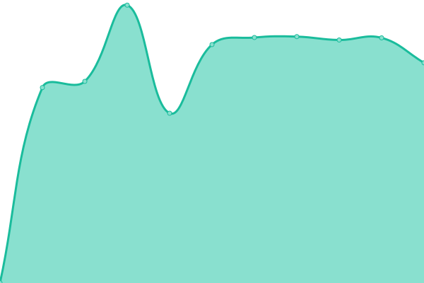

# [📈 Live Status](https://upptime.github.io/upptime): <!--live status--> **🟩 All systems operational**

This repository contains the open-source uptime monitor and status page for [Upptime](https://upptime.js.org), powered by [Upptime](https://github.com/upptime/upptime).

With [Upptime](https://upptime.js.org), you can get your own unlimited and free uptime monitor and status page, powered entirely by a GitHub repository. We use [Issues](https://github.com/upptime/upptime/issues) as incident reports, [Actions](https://github.com/paulluxford/uptime/actions) as uptime monitors, and [Pages](https://upptime.github.io/upptime) for the status page.

<!--start: status pages-->
<!-- This summary is generated by Upptime (https://github.com/upptime/upptime) -->
<!-- Do not edit this manually, your changes will be overwritten -->
<!-- prettier-ignore -->
| URL | Status | History | Response Time | Uptime |
| --- | ------ | ------- | ------------- | ------ |
|  [WPGeni](https://wpgeni.com) | 🟩 Up | [wp-geni.yml](https://github.com/paulluxford/uptime/commits/HEAD/history/wp-geni.yml) | 

 1220ms
     
 | 

<a href="https://paulluxford.github.io/uptime/history/wp-geni">100.00%</a>
    

|  [GCBW](https://goldcoastbusinesswebsites.com.au) | 🟩 Up | [gcbw.yml](https://github.com/paulluxford/uptime/commits/HEAD/history/gcbw.yml) | 

 1211ms
     
 | 

<a href="https://paulluxford.github.io/uptime/history/gcbw">100.00%</a>
    

|  [Redefining Health](https://redefininghealth.com.au) | 🟩 Up | [redefining-health.yml](https://github.com/paulluxford/uptime/commits/HEAD/history/redefining-health.yml) | 

 1183ms
     
 | 

<a href="https://paulluxford.github.io/uptime/history/redefining-health">100.00%</a>
    

|  [Professional Pest Manager](https://professionalpestmanager.com) | 🟩 Up | [professional-pest-manager.yml](https://github.com/paulluxford/uptime/commits/HEAD/history/professional-pest-manager.yml) | 

 1493ms
     
 | 

<a href="https://paulluxford.github.io/uptime/history/professional-pest-manager">100.00%</a>
    

<!--end: status pages-->

[**Visit our status website →**](https://upptime.github.io/upptime)

## 📄 License

- Powered by: [Upptime](https://github.com/upptime/upptime)
- Code: [MIT](./LICENSE) © [Upptime](https://upptime.js.org)
- Data in the `./history` directory: [Open Database License](https://opendatacommons.org/licenses/odbl/1-0/)
