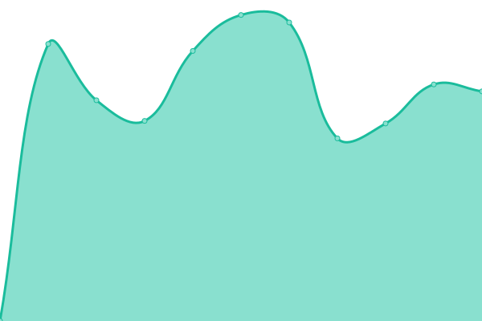

# [📈 Live Status](https://upptime.github.io/upptime): <!--live status--> **🟧 Partial outage**

This repository contains the open-source uptime monitor and status page for [Upptime](https://upptime.js.org), powered by [Upptime](https://github.com/upptime/upptime).

With [Upptime](https://upptime.js.org), you can get your own unlimited and free uptime monitor and status page, powered entirely by a GitHub repository. We use [Issues](https://github.com/upptime/upptime/issues) as incident reports, [Actions](https://github.com/paulluxford/uptime/actions) as uptime monitors, and [Pages](https://upptime.github.io/upptime) for the status page.

<!--start: status pages-->
<!-- This summary is generated by Upptime (https://github.com/upptime/upptime) -->
<!-- Do not edit this manually, your changes will be overwritten -->
<!-- prettier-ignore -->
| URL | Status | History | Response Time | Uptime |
| --- | ------ | ------- | ------------- | ------ |
|  [WPGeni](https://wpgeni.com) | 🟩 Up | [wp-geni.yml](https://github.com/paulluxford/uptime/commits/HEAD/history/wp-geni.yml) | 

 1126ms
     
 | 

<a href="https://paulluxford.github.io/uptime/history/wp-geni">100.00%</a>
    

|  [GCBW](https://goldcoastbusinesswebsites.com.au) | 🟩 Up | [gcbw.yml](https://github.com/paulluxford/uptime/commits/HEAD/history/gcbw.yml) | 

 1119ms
     
 | 

<a href="https://paulluxford.github.io/uptime/history/gcbw">0.00%</a>
    

|  [Redefining Health](https://redefininghealth.com.au) | 🟩 Up | [redefining-health.yml](https://github.com/paulluxford/uptime/commits/HEAD/history/redefining-health.yml) | 

 1096ms
     
 | 

<a href="https://paulluxford.github.io/uptime/history/redefining-health">0.00%</a>
    

|  [Professional Pest Manager](https://professionalpestmanager.com) | 🟥 Down | [professional-pest-manager.yml](https://github.com/paulluxford/uptime/commits/HEAD/history/professional-pest-manager.yml) | 

 1351ms
     
 | 

<a href="https://paulluxford.github.io/uptime/history/professional-pest-manager">0.00%</a>
    

|  [Blinds 2 Go](https://www.blinds2go.com.au/) | 🟩 Up | [blinds-2-go.yml](https://github.com/paulluxford/uptime/commits/HEAD/history/blinds-2-go.yml) | 

 3229ms
     
 | 

<a href="https://paulluxford.github.io/uptime/history/blinds-2-go">0.00%</a>
    

|  [Creative Dance Academy](https://creativedance.com.au/) | 🟩 Up | [creative-dance-academy.yml](https://github.com/paulluxford/uptime/commits/HEAD/history/creative-dance-academy.yml) | 

 1302ms
     
 | 

<a href="https://paulluxford.github.io/uptime/history/creative-dance-academy">100.00%</a>
    

|  [HHH](https://hhh.com.au/) | 🟩 Up | [hhh.yml](https://github.com/paulluxford/uptime/commits/HEAD/history/hhh.yml) | 

 4258ms
     
 | 

<a href="https://paulluxford.github.io/uptime/history/hhh">0.00%</a>
    

|  [Integrated Health Specialists](https://integratedhealthspecialists.com.au/) | 🟩 Up | [integrated-health-specialists.yml](https://github.com/paulluxford/uptime/commits/HEAD/history/integrated-health-specialists.yml) | 

 2245ms
     
 | 

<a href="https://paulluxford.github.io/uptime/history/integrated-health-specialists">100.00%</a>
    

|  [Manns Pest Control](https://www.mannspestcontrol.com.au/) | 🟩 Up | [manns-pest-control.yml](https://github.com/paulluxford/uptime/commits/HEAD/history/manns-pest-control.yml) | 

 1877ms
     
 | 

<a href="https://paulluxford.github.io/uptime/history/manns-pest-control">0.00%</a>
    

|  [Nautilus Law](https://nautiluslaw.com.au/) | 🟩 Up | [nautilus-law.yml](https://github.com/paulluxford/uptime/commits/HEAD/history/nautilus-law.yml) | 

 2349ms
     
 | 

<a href="https://paulluxford.github.io/uptime/history/nautilus-law">100.00%</a>
    

|  [Richards Pest Control](https://richardspestcontrol.com.au/) | 🟩 Up | [richards-pest-control.yml](https://github.com/paulluxford/uptime/commits/HEAD/history/richards-pest-control.yml) | 

 2666ms
     
 | 

<a href="https://paulluxford.github.io/uptime/history/richards-pest-control">0.00%</a>
    

|  [Rose Petals](http://rosepetals.com.au/) | 🟩 Up | [rose-petals.yml](https://github.com/paulluxford/uptime/commits/HEAD/history/rose-petals.yml) | 

 1487ms
     
 | 

<a href="https://paulluxford.github.io/uptime/history/rose-petals">0.00%</a>
    

|  [The Flower Factory](http://theflowerfactory.com.au/) | 🟩 Up | [the-flower-factory.yml](https://github.com/paulluxford/uptime/commits/HEAD/history/the-flower-factory.yml) | 

 3780ms
     
 | 

<a href="https://paulluxford.github.io/uptime/history/the-flower-factory">0.00%</a>
    

<!--end: status pages-->

##[**Visit our status website →**](https://paulluxford.github.io/uptime/)

## 📄 License

- Powered by: [Upptime](https://github.com/upptime/upptime)
- Code: [MIT](./LICENSE) © [Upptime](https://upptime.js.org)
- Data in the `./history` directory: [Open Database License](https://opendatacommons.org/licenses/odbl/1-0/)
